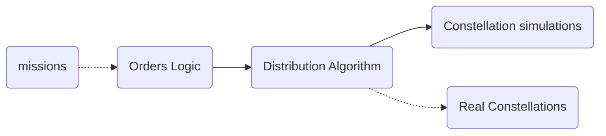

# But that's like, your assumption

One of the important things one does when designing a system, and especially an algorithm, is to discuss the assumptions of the problem.

## What are assumptions
These aren't exactly a part of the need for the system, but rather are inferred from the needs, and help us reach the correct solution. When it comes to algorithms, these assumptions will help us to research the different solutions people have come up with over the ages, and analyze whether they fit our assumptions or not.

### An example
For example, if we were to take the shortest path problem:
> There is a graph, with start and end nodes, and each edge has some length. We need to find the path for which the sum of edge-lengths is minimal.

That is the problem, what are the assumptions?

Well, these aren't necessarily in the problem description. They are the answers to the questions we ask about the problem:
- How much time do we have to reach a solution?
- How large is the graph?
- Is the problem dynamic? Are vertices and edges added and removed while we run? If so, how fast compared to the time we have to reach a solution?
- How long does it take to calculate the length of an edge? Is it constant, or does it depend on some hidden data?

The answer to these questions will allow us to find the most fitting solution.
For instance, Dijkstra or A* are great algorithms for solving the shortest path problem, but only if the graph is constant and doesn't change. On the other hand, if the problem is dynamic, but the speed at which it changes is far slower than the time it would take to run Dijkstra, then there's no need to think of a dynamic solution, and we can simply run the algorithm each time there is a change.

You can see that these questions are of course a part of understanding the needs, and they translate into assumptions which allow us to find the most fitting solution to our specific needs. Most of the time, the job of the engineer isn't to find an innovative solution to the current problem, but to build upon known solutions to similar problems and fit them to the current one.

## And in our case
So let's talk about the aspects that help and hinder our solving the constellation planning problem:

#### Difficulties
- Order requests vary in types
- Constellations have different capabilities
- There are a lot of unknown factors - what other requests the constellations have, whether once a request has been made it will truly be taken etc.
- Constantly changing input - more demands are added, open demands change as parts of them are gathered, constellation potential is used, or blocked or opened.
- Some of the constellations are internal and some are external - And of course the order requests can be sensitive data, so needs to stay internally.

#### Advantages
- The solution doesn't have to be perfect since even an OK solution is a division that can be used
- The more constellations there are, the harder the problem becomes on the one hand, but on the other hand the less accurate the solution needs to be since we have more gathering potential (in theory)
- This is a new problem, so there's not much competition, and no legacy systems either
- Compute shouldn't be an issue

#### Neutral assumptions
- The run time will take between several minutes and a day - might not have to be **really** fast
- The system will be long lasting and will continue being upgraded

### Let's talk
As you can see, these issues can mainly be divided into the good ones, the bad ones, and those that can be (n)either. These are the reasons we decided we can split the whole system into three parts.

(I'll just stick the diagram here again to make things easier)

The division allows us to split the complexity of variety both on the orders side, and the constellations side - separating the two problems. This reduces each side into a one dimensional problem instead of a 2D one.

It should also allow us the ability to add more constellations as we proceed - as long as we have a new constellation-simulation, it shouldn't be a problem.

On the other hand, the less good side of the separation into these modules is the reduction of quality of information passing between the sides. This means that our ability to plan accurately what each constellation can really take is worse than a more integrated system could probably perform. On the other hand, we noted that our rate of accuracy and quality doesn't have to be high, so we are willing to pay this cost in order to increase simplicity which hopefully will allow us to create a progressively better system as the years go by.

As you can see, a large part of designing our system is based on the assumptions we make. We haven't really reached into how the different sections work, and we'll do so in the next posts!

---
- [TOC](../TOC.md)
- Previous post: [Who would have thought](./Who%20would%20have%20thought.md)
- Next post: [The Game](./The%20Game.md)
