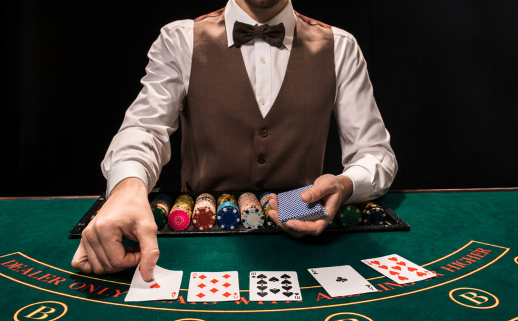

# The Game host


A central part of my distribution algorithm, is the game-host - that decides what phase it is and runs the whole show. Later on the communications will be more complex since I plan to turn the whole system into a micro-service-multi-server system.

But lets talk about this section of the code for now, simply because I'm rather proud of the way I wrote it.

I'll stick it here, for your perusal, and then talk about what's going on. 

## Code Review
#### Note:
- In my system its split into 2 files.
- I added comments on the unimportant code that I'm not going to talk about...

### Phases
The phases are the actual functions that run all the parts of the game - mostly the players taking actions.

I'll split this into functions, with a short description after each one:

```TS
import { findOrders } from '../market.js'; // some logic
import type { Order } from '../types/order.js'; // types
import { bid, clearBids } from '../broker.js'; // broker logic
import { getNewOrders, updateBounties } from '../client.js'; // client logic
import type Client from '../types/client.js'; // that's right... types
```
These are just imports, nothing very interesting.

```TS
const constellationsBid = (
  constellations: string[],
  pickPercentage: number,
) => async () => {
  console.log('>> bid phase');
  await clearBids();
  await Promise.all(constellations.map(async (constellation) => {
    await bid(constellation, pickPercentage);
  }));
};
```
All the constellation brokers bid on the orders. They can all do so in parallel, but we must wait for them all to finish. Note also, that we clear all the bids from the previous time the bidding occured.

```TS
const clientsUpdateBounties = (
  clients: Client[],
  bountyStep: number,
) => async () => {
  console.log('>> update bounties phase');
  await Promise.all(clients.map(async (client) => updateBounties(client, bountyStep)));
};
```
Each client checks all the orders it sent, and updates the bounties according to the bids and its internal state - for instance how much money it has to distribute.

```TS
const clientsGetNewOrders = (clients: Client[]) => async () => {
  console.log('>> get new orders phase');
  await Promise.all(clients.map(getNewOrders));
};
```
Each client fetches all the new orders from the orders-service and adds them to the market with an initial bounty.

```TS
const checkGameEnded = async () => {
  console.log('>> checking if game has ended');
  const allOrders: Order[] = await findOrders({ status: 'open' });
  const conflict = allOrders.every((order) => order.bidders.length < 2);
  if (!conflict) console.log('found conflicting orders');
  return conflict;
};
```
We check if the game has ended by checking whether there is still competition on any orders - meaning if 2 or more brokers have bid on any one order.

```TS
export {
  constellationsBid,
  clientsUpdateBounties,
  clientsGetNewOrders,
  checkGameEnded,
};
```
Just exports...

### Overall
As you can see, the phases are pretty straightforward, each one runs the relevant functions of the relevant players (clients or brokers). Finally, there is a phase of checking if the game has ended that returns a bool.

For more information on the phases check out [The Game](./The%20Game.md).

### Game-host
This is the more complicated part, the previous was just some background on what phases there are going to be.

Here, I wanted to create a game which is in fact a set of phases that occur one after the other, until some end state has been reached.

We'll note that the phases are async - which means that we need to await each one.

Try reading through it, And I'll give some explanations at the end.

```TS
import type Client from '../types/client.js'; // just some type
import config from '../config.js'; // global config file
import { clearOrders } from '../market.js';
import {
  constellationsBid, clientsUpdateBounties, clientsGetNewOrders, checkGameEnded,
} from './phases.js'; // You've seen this already

const createPhase = (
  currentPhase: () => Promise<void>,
  nextPhase: () => Promise<void>,
  checkEnd: boolean = false,
) => async () => {
  await currentPhase();
  if (checkEnd) {
    const runFlag = await checkGameEnded();
    if (!runFlag) setImmediate(() => nextPhase());
  } else setImmediate(() => nextPhase());
};

const generatePhases = (
  clients: Client[],
  constellations: string[],
) => {
  let bidPhase = async () => {};

  const updateBountiesPhase = createPhase(
    clientsUpdateBounties(clients, config.bountyStep),
    async () => { bidPhase(); },
    false,
  );

  bidPhase = createPhase(
    constellationsBid(constellations, config.pickPercentage),
    updateBountiesPhase,
    true,
  );

  const getNewOrdersPhase = createPhase(
    clientsGetNewOrders(clients),
    updateBountiesPhase,
    false,
  );

  return getNewOrdersPhase;
};

const runGame = async (
  clients: Client[],
  constellations: string[],
) => {
  const getNewOrdersPhase = generatePhases(
    clients,
    constellations,
  );
  await clearOrders();
  await getNewOrdersPhase();
};

export default runGame;

```

Right! So lets go from the bottom up (which is actually top-down because that's how you write code in JS).

We export a function called runGame, that recieves a list of clients and constellations (which are also called brokers).

The function calls `generatePhases` with the clients and brokers, then clears the DB (just to make sure actually), and runs `getNewOrdersPhase` which it got from the `generatePhases` function.

So what does `generatePhases` do and why does it return the `getNewOrdersPhase` function and nothing else? Well its easy to see [here](./The%20Game.md) that that is the first phase of the game (every client gets his orders and adds them to the market). So let's dive in and see why that is all we need.

Each phase is created with created using the `createPhase` function. Let's study that first:
```TS
const createPhase = (
  currentPhase: () => Promise<void>,
  nextPhase: () => Promise<void>,
  checkEnd: boolean = false,
) => async () => {
  await currentPhase();
  if (checkEnd) {
    const runFlag = await checkGameEnded();
    if (!runFlag) setImmediate(() => nextPhase());
  } else setImmediate(() => nextPhase());
};
```

The createPhase function get as arguments:
1. currentPhase - a function which it runs and waits for
2. nextPhase - a function it adds as to the setImmedeate queue
3. checkEnd - a bool which tells it whether to check if the game has ended or not. If it checks, then it can optionally call the next phase, or it can skip that and simply return

So the `createPhase` function runs an async function, optionally checks if the game is over, and adds the next phase (if the game isn't over, or if end wasn't checked).

This is the most difficult function to understand here.

### Question: Why call setImmediate and not simply call the function?
Because since the game is potentially never ending, it could run into stackoverflow. In order to mitigate that, we never call the next phase from within the previous function, and rather use NodeJS's runloop to run the next pase.

Now we'll return to `generatePhases`:
```TS
const generatePhases = (
  clients: Client[],
  constellations: string[],
) => {
  let bidPhase = async () => {};

  const updateBountiesPhase = createPhase(
    clientsUpdateBounties(clients, config.bountyStep),
    async () => { bidPhase(); },
    false,
  );

  bidPhase = createPhase(
    constellationsBid(constellations, config.pickPercentage),
    updateBountiesPhase,
    true,
  );

  const getNewOrdersPhase = createPhase(
    clientsGetNewOrders(clients),
    updateBountiesPhase,
    false,
  );

  return getNewOrdersPhase;
};
```

So here we see that each phase is created by creating a phase with one of the functions from the phase section, and by calling the next phase.

We want to check if the game is over after bidding, since our end test is whether there are conflicting bids.

### Question: Why don't we return all the phases?
These phase-functions are closures, which means that we don't need to return all the functions up to the caller, but only the first phase, since it remembers the next phase and so on. This is also the reason why we declare `bidPhase` before calling it.

## But why like this?
If you look at it in a more general perspective, the game is a state machine where each state goes to the next state (unless we reached the end state). If we want to add more phases, its pretty simple to add the relevan function to the first part (the part that actually does something), and then add the phase with the relevant nextPhase. Additionally, if we wanted a phase that could go to two optional phases, it's not difficult to add a function with a branch that gets the two phases, and decides between them.

This is a very general game host that will allow us to change the game rules later on - just like we talked about in the previous post.

---
- [TOC](../TOC.md)
- Previous post: [The known the unknown and the ugly](./The%20known%20the%20unknown%20and%20the%20ugly.md)
- Next post: -
