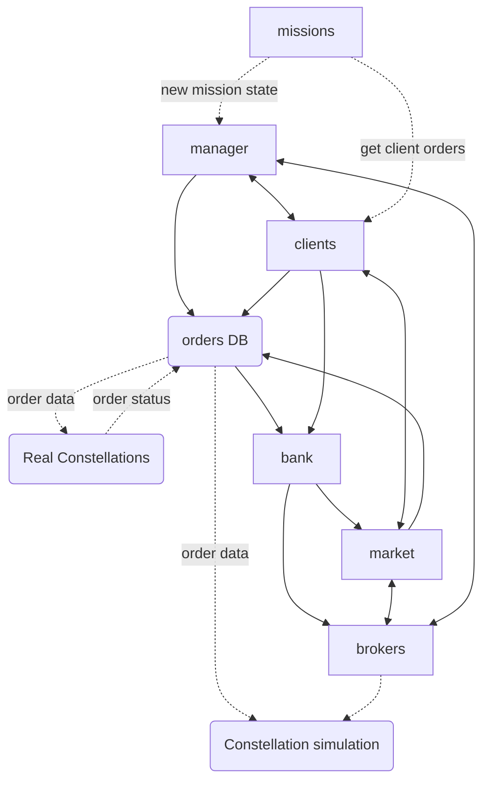

# The known, the unknown, and the ugly

So now that we've covered some of the theory, and what we're trying to do here, let's start talking about how we're going about building the whole damn thing.

Because if we just talk theory and modeling, we'll never get round to the practical side. And mainly, because in truth, although I have some more thoughts I'd like to write, I also really don't know exactly how its all going to work out. And for the sake of being careful not to make a fool of myself, I'd prefer to reserve my ideas to the point where I can test them, before committing them to paper.

And since there are a lot of **unknown** aspects in this problem, it makes for an interesting development experience, which I think is worth talking about as well.

## What we know
So lets start by what we know we'll have in our system.

### Distribution algorithm
This will be composed of the following:
- **Market:** the centralized system that manages the go-betweens
- **Bank:** the system in charge of the allowances and balance of the clients, brokers and market
- **Client** (or client agents): the ones in charge of changing the bounties of the orders, and seeking to reduce their costs as much as possible
- **Broker:** (or constellation agents): the ones in charge of deciding what their constellation bids on, and seek to maximize on reward while reducing cost
- **Manager:** in charge of making the whole game spin
- **Orders DB:** holds the order's data so that everyone can use it. Its important also in order to remember what orders were sent on to the constellations, o we do not resend them needlessly

### The interactions we know about
- We know there's a market that holds the order bounty and bids
- There's going to be a client (or clients) that get orders from outside, and send them to the market
- The brokers look for the best orders in the market and bid on them
- The brokers use the constellation simulations to understand what the costs might be
- The bank is in charge of managing the money transfers between everyone - but mainly from the clients to the brokers
- There's a DB for the orders so that whoever needs the data can access it. In addition, the order status is updated there, which allows us to gain more knowledge about what has been achieved
- According to the order's status, the bank learns when commit a transaction.
- The manager is in charge of running the whole game, and sending orders to everyone

## What we know we don't know
As you can see, we know who talks with whom, and what about more or less. But what I didn't describe was how each component works. These are the important unknowns.

**TODO**

## What we don't know
I dunno, but give me a year, and I'll tell you what I learned on the way Just remind me ok?

## Creating a system with large unknowns
This is the interesting bit, and naturally it crops up every time software is created, but I feel that more so with algorithmic systems - where a great deal of research needs to be done.

We could do the research first, and that is a great way to mitigate risk if we aren't sure we need the system in the first place, or if it solves our problem, but here we understand that we must have an order distribution system, so given that even a very simple solution would be a good first step, we want to design a system that is very very simple at first, but can potentially become more complex later on.

Of course all this could be a load of bullshit, and I should be doing the research right now instead of creating systems - we'll know that maybe later on - but for now let's assume this is the right course of action.

So what should I write? And how should the system be created just now, in relation to how it should be later on.

### System requirements

Let us look at the requirements in creating an initial running system:
*(note that what I call the system here is in fact the **initial system**, not the final one)*.

1. The system should be written from end to end in a matter of 1-3 months
2. The system's components should exist in the final system as well if in a different shape
3. The system should be flexible and allow changes to logic and components
4. The system should run on real data of existing constellations and orders
5. The system should be scalable - but relate mainly to existing constellations and connections, not future ones
6. The code should be reusable in the **final** system

### System not-requirements
Let us take notice of the aspects that may be required of the final system, but not of the initial one:

1. The system need not generate a good solution
2. The system need not work under any limit of time or compute
3. The system need not connect to the constellations and be used by the user

### So where does this put us

As you can see, we're mainly trying to create the system from end to end, but without any requirements of quality or speed. We want to see the system run, to understand how it can be integrated with the constellations and clients, but without necessarily being used at first if it cannot be trusted.

We are now writing the system - and what is written here will be transformed into the fully working system. [This is no POC, but rather an MVP](https://www.codica.com/blog/poc-vs-mvp/).

These two facts together imply that we need to make sure the architecture is good, but allow the use of untested algorithms in each component. Furthermore, we can make very simplistic logic, but divide the full system into its modules and components, even if they aren't fully cooked.

## The leads us to
Well, to writing the components I know need to exist, with a minimal logic, but making sure they are production-grade code.

What I'm writing for now is:
### The market
This should be a DB with all the bidders bounties for each order, but right now its just a dictionary of orders with functions to get, and update the orders (similar to how mongo works, since that's one of the options of the DB we'll be using, although Redis is also an option - more about that when we get there).

### The client
The client gets orders from ...(somewhere, integration is hard!), and adds them into the market with a bounty.
In addition, it needs to get all of its orders, and update the bounties according to what bids were placed on them (and on its allowance but I left that for later).

### Broker
The broker checks the market for orders, and then uses the constellation simulation to understand whether it can take them and what the cost would be. According to that, and with an additional layer of logic it decides what to bid on, and sends the bids to the market.

The constellation simulation will run on a separate server, and creating a basic simulation will be the next step.

This broker is very general, I wrote so that it gets the constellation as an argument, and is logically the same for all constellations in order to force my future self (or team) to create a scalable broker that will work with all constellations as long as the simulation API is the same.

## Summary

They say that Leonardo DaVinci, when he drew the Mona-Lisa, first drew the bones, and then added the muscles, tendons, skin and finally clothes. When we look, we can see only the clothes and the ineffable smile.

I find, that sometimes it is very helpful to create projects in this manner. first the skeleton, then later, the muscles, tendons and veins that make the system really live and move about (I'm sure you can think up a good metaphore for each part).

There are a lot of questions in this brand new problem, and hopefully, we'll reach a solution that not only works passably well, but will also allow for improvements and changes later on, when some of the questions have been answered. Sometimes the answers will change, so be careful even when you're pretty sure you know the answer.

I think that when you set about building a project from nothing, think of several different solutions, look at what they have in common, and how you can change the other solutions to fit these common traits. Don't pick a solution, but rather pick the best traits that will allow you to pick the right solutions when you can make wiser choices

---
- [TOC](../TOC.md)
- Previous post: [Pretend its a constellation](./Pretend%20its%20a%20constellation.md)
- Next post: -
