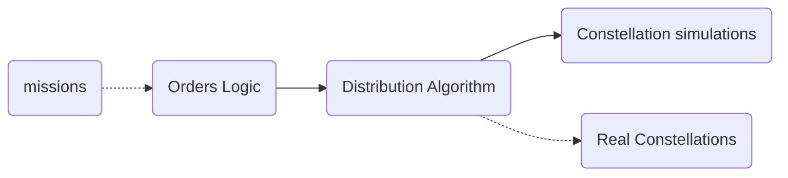

# Who would have thought
Note to readers:
*This blog may come out a bit of a memoir, but I'll try to make that part short, and get to the point quickly.*

### How I joined
A while back now - around spring 2022, I was working in a team that automated collection planning for a group of satellites. Nice interesting job - lot's of hard work - but overall fulfilling.

Then a guy named TB (he's completely healthy don't worry) said he wanted to talk with me and some others. We met on a video chat, and he explained that there was some work-group session in the summer where groups took some subject that was important and hacked at it for a month under the tutelage of University professors and such. Would we like to form a group that would take the problem of constellation management and work on that?

I thought: (italics means I'm thinking) *sounds cools, except for the bit about professors. Why don't they bring people who actually have a connection to reality?* Don't worry about my hurting the academy folk's feelings, they've got it coming in the last 400 years. 100 at least!

Anyway, we said sounds cool - and TB told us he'd organize everything, and we'd just have to meet the professors for them to grant us the privilege of collaborating with them (see? stuck-ups) and if the assented, we'd probably get in.

Well folks, I'm telling you truly that TB made good on his word and before long we sat down to a talk with those profs, and they even seemed pretty canny to me which was surprising.

So during the summer heat, I spent a month, apart from my team, at a hotel with good food, and air-conditioning, writing a POC for the constellation planning problem. It didn't work, but we saw and approved.

What's the constellation planning problem? Well maybe its about time I said a few words on the subject. Then I'll explain what we did in the work-group, and why I came out feeling we had accomplished something.

### What's the constellation problem you ask?
So as I explained [here](Some%20of%20the%20basics.md):
the [users](Some%20of%20the%20basics.md#users)
send [missions](Some%20of%20the%20basics.md#missions-and-orders)
which can be taken by some of the
[constellations](Some%20of%20the%20basics.md#Satellite-constellation)
and someone needs to decide to what
[constellation](Some%20of%20the%20basics.md#Satellite-constellation)
to send the
[orders](Some%20of%20the%20basics.md#missions-and-orders)
that resolve
the [users'](Some%20of%20the%20basics.md#users)
missions.

And so the problem can be redefined as:

> Given some set of satellite missions, find an optimal distribution between existing constellations such that the maximum amount of mission value is fulfilled.

See? an optimization problem. We want to decide what constellation should take what mission order, where each mission has some value, and our ~~mission~~goal is to maximize the value of the missions fulfilled by the [products](Some%20of%20the%20basics.md#Product) returned from the constellations.

### What's the problem?
I mean, I just explained the problem. So let's rephrase the question:

***Why is the problem difficult?***

Good question.

I mean its good, because otherwise I'd be out of a job right?

Let's think of it like this. There are a few bright startups that have launched their satellites and are now offering sat-imagery services online.
#### Constellation I
We can imagine one service for instance, that gives recurring images, so that a farmer can monitor his crops, or a city its buildings and roads. Therefore, in order to make a request, one gives them an area, start and end dates, and the interval between images.
```json
{
  "client": "Jill",
  "time": {
    "start": "2023-01-01",
    "end": "2024-01-01"
  },
  "interval_days": 4,
  "area": {
    "type": "polygon",
    "coordinates": [[[0,0]]]
  },
  "resolution_m": 5,
  "priority-level": 1
}
```
In addition, there are two levels of priority - the first level comes before the second, meaning that if there are two orders that cannot both be taken, the constellation decides upon the one with the higher level, and if they are equal, than randomly or according to internal preferences.

#### Constellation II
A second constellation works more dynamically, but with no memory. Each time you want an image, you must request it. It has a valid time window, and area, plus resolution. In addition, you can request the angle at which the order is taken - for instance if you want to look at the side of a mountain.
```json
{
  "client": "Jill",
  "relevant-time": {
    "start": "2023-01-01T07:00:00.000Z",
    "end": "2023-01-01T17:00:00.000Z"
  },
  "area": {
    "type": "polygon",
    "coordinates": [[[0,0]]]
  },
  "resolution_m": 5,
  "azimuth-range": [30, 150]
}
```
The priority of this constellation works according to the order of submission. Meaning that if to orders collide, the preferred one is the one requested earlier. This allows the constellation service to respond immediately whether an order will be taken, whereas in the previous constellation the decision of whether an order is taken or not occurs only later.

#### Multiple constellation problem
As we can see, this abundance of constellations means that each constellation works in its own manner, and we have to suit our orders and decisions according to them. So how can we create a system that decides what orders to distribute to which constellation, when it is hard to compare between the capabilities of the constellations?

#### Multiple mission problem
On the other hand, we have missions that are also varied and changing. Each one can be translated into a set of orders, depending upon the constellations - for instance if we have a large area that needs to be taken, one constellation could possible refer to this as a single order - which creates a sweep of the area, whereas another constellation will regard this as a set of orders - each one gathering a part of the whole area, and together covering the lot.

#### The problem summary
So as you can see, our main issue is that the variety of constellations and orders - although an advantage from the customer's point of view, turns the problem of extracting orders from missions, and deciding to which constellation to send them in turn, into a difficult problem indeed.

The problem isn't simply finding the best fitting optimization algorithm to the [constellation problem](#What's-the-constellation-problem-you-ask?), but rather **finding a translation of the real world, into a problem that can even be solved with an optimization algorithm!**

### So what did we do in the month-long-group-session
Mainly we talked about how to translate the problem into one that could be feasibly solved with a computer, and talked about how it would work under the strain of increasing quantities of user and constellations, the ability to solve the variety problems, and of course the regular design questions like scalability, agility, explainability and all the rest of the 'ilities'.

The solution we came up with is this:

### The solution

So the solution we hit upon is the following:

We'll divide the problem into three separate parts:

1. **Orders Logic:** This gets the missions from the users, and manages their status, creates corresponding orders and updates them.
2. **Constellation simulations:** This simulates what the constellation might be able to take together. It helps us understand what the potential of the constellation is, what orders may conflict with each other, and what may be taken together at the cost of one order.
3. **Distribution Algorithm:** This module is the one that takes the orders, simulates possible potentials with the constellation simulations, and decides upon a distribution that should maximize the gain of all the missions together. the orders shall be sent to the constellations according to this distribution, and the missions updated accordingly in the orders logic module.

This division of the problem into three, more manageable sub-problems, is the start of a solution. We also discussed possible designs and types of each component, and although we didn't succeed in running the simulation on any real data, we did write most of the components down - in a very basic manner, and we feel that a solution is possible.

## Summary
As you can see, there is a lot to talk about. Maybe even this post raises more questions than it answers. Please ask the questions so that I can respond in future posts.

Be sure that there's a lot more to say about this design, and about what each component does - not all is answered, but there are some ideas and directions.
We'll probably dive into these modules and what they mean later on (check the [TOC](../TOC.md)). I'll try to add links here as well.

---
- [TOC](../TOC.md)
- Next post: [Assuming it works](./posts/Assuming%20it%20works.md)
